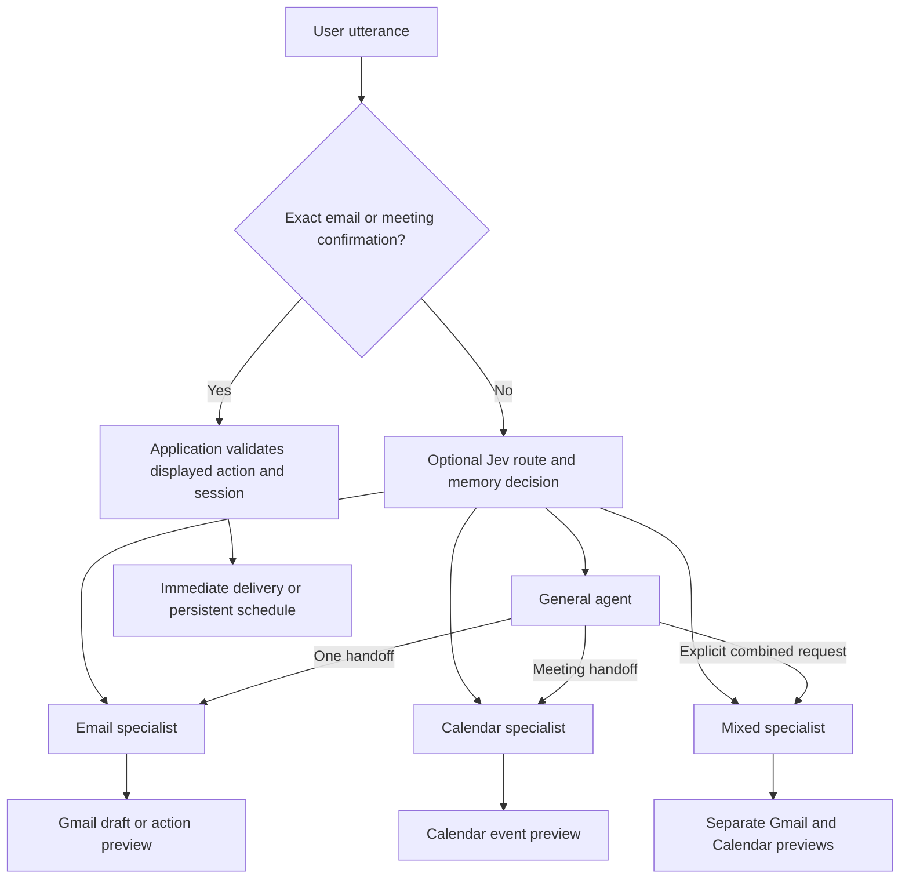

# Jarvis — Personal AI Assistant

Windows voice assistant with general, Gmail and Google Calendar specialists, plus optional Jev routing. Uses cloud LLMs through Gemini, OpenAI or Anthropic. Python 3.12.

## Setup

Run PowerShell as Administrator for the keyboard hooks. Work directly in `D:\Jarvis`.

```powershell
python -m venv jarvis-env
.\jarvis-env\Scripts\Activate.ps1
python -m pip install -r requirements.txt
```

For a new installation, copy `.env.example` to `.env` and enter your LLM provider key. For an existing installation, merge the new settings into `.env` without replacing its keys.

Place `kokoro-v1.0.onnx` and `voices-v1.0.bin` in the project root. The speech engine falls back to `kokoro-v1.0.int8.onnx` if the full model is absent. The GeoIP tool also needs `data/GeoLite2-City.mmdb`. Whisper and Chroma embedding models may download on first use.

```powershell
python main.py
```

Current STT defaults are CPU with `tiny` for voice sessions and `base` for dictation. Kokoro uses CPU at speed 1.15. It preloads after Jarvis starts listening and prepares upcoming audio during playback. The full model uses more RAM but synthesized substantially faster than int8 on the target machine. Set `TTS_MODEL=kokoro-v1.0.int8.onnx` to select the smaller model, or `TTS_PRELOAD=false` to load speech on the first response.

## Usage

| Mode | Hotkey | Behavior |
|---|---|---|
| Jarvis | CTRL+SHIFT+J | Toggle a conversation; a pause in speech submits each turn |
| WhisperFlow | CTRL+SHIFT+K | Toggle dictation and type the transcription at the cursor |

The microphone stays paused while Jarvis processes or speaks. The two modes share one recorder. Say “start fresh” to save the current conversation and clear its context.

Hotkeys toggle once when released. Speech model loading runs in a separate controller; wait for “Session started” or “Listening” before speaking. The first activation can take several seconds. Toggle the same hotkey again during loading to cancel activation. End the current mode before starting the other one.

General tools cover web research, weather, notes, reminders, memory, screen reading, content generation, clipboard delivery and desktop controls.

## Gmail agent

**[Connect Gmail and configure scheduling](docs/email.md)** before enabling email. Gmail and Jev are disabled by default.

Supported requests include:

- “Draft an email to alex@example.com asking to meet tomorrow.”
- “Make that draft shorter.”
- “Send draft one.”
- “Schedule draft one for tomorrow at 9 AM.”
- “List my scheduled emails.”
- “Cancel email action two.”
- “Reschedule draft one for Friday at 2 PM.”

Drafts are saved in Gmail. Sending and scheduling require a full terminal preview followed by a separate utterance: **“Confirm email [action number].”** Confirmations expire after ten minutes or when the session ends. A draft ID identifies the message; an action ID identifies a send or schedule request.

Email planning and writing use a dedicated Gemini profile: `EMAIL_MODEL=gemini-3.8-flash` and `EMAIL_THINKING_LEVEL=low`, using `GEMINI_API_KEY`. Routine requests retain their configured model. Email calls use structured output, a 20-second timeout and a 4,096-token output ceiling; account access and quota errors are reported without silently switching models. Arguments are validated before Gmail access, with one correction attempt for malformed tool calls. Missing recipients or scheduling times are clarified before delivery approval.

Start with just the purpose: “Schedule an email asking Alex about a software role.” Jarvis saves a useful draft, asks for the address, then asks for the time. Short replies such as “alex@example.com” and “tomorrow at 9 AM” continue the same draft. Recipient changes preserve its subject and body. Missing optional details do not block drafting; unclear addresses are left for clarification. The pending action stays in the current session; saved Gmail drafts remain available after a restart by draft ID.

Scheduling uses a separate Windows worker and SQLite state. Keep the PC awake, online and logged in. The worker runs without the voice app. Jobs more than 60 seconds overdue become `missed` and require a new time and confirmation.

### Calendar meetings

Calendar setup uses the same Google Desktop OAuth account. Enable both the Gmail and Google Calendar APIs, then reconnect using `python -m email_agent connect` so the account receives the Calendar grant. See [Calendar setup and operation](docs/email.md#google-calendar-meetings).

Supported requests include:

- “Schedule a meeting with Alex about the project review tomorrow at 3 PM, alex@example.com.”
- “List my calendar this week.”
- “Move Jarvis meeting one to Friday at 2 PM.”
- “Cancel Jarvis meeting one.”

Each meeting change shows a full terminal preview and requires its own **“Confirm meeting [action number]”** utterance. Meeting invitations go to guests after approval. Email delivery times and meeting start times are handled as separate actions. Jarvis manages one-off events on the primary calendar, defaults to 30 minutes and `EMAIL_TIMEZONE`, and does not look up contacts or create Meet links.

Version one supports one Gmail account and plain text messages, with To/Cc/Bcc. Inbox search, reply threads, attachments, HTML, aliases and contact lookup are outside this version.

## Routing and execution



Jev classifies intent; dedicated structured action profiles plan email and Calendar work. When Jev is disabled or unavailable, clear workspace requests and pending workflow replies route locally. Unclear requests use the general agent, which can gather context and hand off once. All specialists share one six-step budget. Malformed decisions get one repair attempt within that budget before tool execution. Tool permissions are enforced by the dispatcher, and only read operations can run in parallel. Models cannot confirm email sends or meeting changes.

## Development and checks

```powershell
python -m pip install -r requirements-dev.txt
python -m pytest -q
python -m pip check
python -m email_agent --help
```

Tests use synthetic messages, fake providers and temporary databases. They cover confirmations, duplicate prevention, scheduling, recovery after interrupted delivery, routing, SDK contracts, audio cancellation and session lifecycle. They do not send live mail or use paid model calls.

Optional email checks:

```powershell
python -m ops.email_check --live-model
python -m ops.email_check --gmail-draft
```

The first uses Gemini with synthetic multi-turn conversations and an in-memory mailbox, excluding your profile and memories. It incurs normal model usage and writes a metadata report to `.test_runs/email_harness_live.json`. The second creates one temporary Gmail draft without recipients, adds the connected account as its recipient, verifies the content, then deletes that draft. Neither check sends or schedules email.

To check the actual speech models, VAD, pause/resume and recorder process cleanup with bundled sample audio:

```powershell
python -m ops.audio_check
```

This check disables the microphone and exercises both CPU models; it can take about a minute and needs the Whisper model files.

To check physical microphone capture, both model startups, and repeated cleanup through the application entrypoint:

```powershell
python main.py --check-audio
```

The microphone check counts incoming chunks without saving or transcribing their contents. Microphone capture begins after the model is ready. Startup supervises the Whisper worker so cancellation, a worker crash, or a readiness timeout releases the mode instead of waiting indefinitely.

Windows child processes import only the lightweight entrypoint. Windows OCR is imported when screen reading is requested; loading it before the speech libraries caused native DLL initialization failures on the target machine.

These checks do not test physical hotkeys or typing into a desktop application. For a live check, start `main.py` as Administrator, complete two Jarvis turns, stop the session during a response, then toggle dictation on/off in a blank editor and switch back to Jarvis.

To benchmark both local speech models with Whisper loaded, and optionally play two synthetic sentences:

```powershell
python -m ops.speech_check
python -m ops.speech_check --play
```

Speech timing, first playback, output underruns, model calls and tool durations appear in `.traces/events.jsonl`. Simple time/date/weather-only requests skip the separate memory-classifier call.

## Main files

| Location | Purpose |
|---|---|
| `main.py`, `modes/` | Hotkeys, session ownership, reminders and response delivery |
| `modes/controller.py` | Quick hotkey command submission and serialized mode transitions |
| `agent/loop.py`, `agent/specs.py` | Shared execution budget and agent tool permissions |
| `agent/router.py` | Optional TypeSafe Jev classification |
| `email_agent/` | Gmail OAuth, drafts, approvals, SQLite jobs, scheduler and CLI |
| `stt/stream_stt.py`, `tts/playback.py` | Recorder ownership and shared cancellable playback |
| `llm/client.py`, `memory/` | Cloud providers, retrieval and session memories |
| `tools/registry.py` | General and email tool dispatch |
| `tests/` | Automated behavior and integration contract checks |

Gmail credentials are stored in Windows Credential Manager. `email_jobs.db` stores email content locally and is excluded from Git. Email turns are excluded from automatic fact extraction and session summaries. New traces contain metadata only and rotate with size limits. Existing logs and historical traces are retained; see the [setup guide](docs/email.md#data-and-diagnostics) for details.
